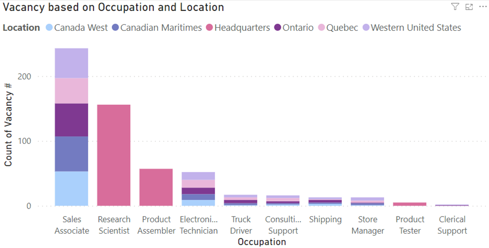

# **Report**
## I.	**Problem statement**:
The case study is based on Northern Electronics and Telecommunications (Norcan) founded in 1965 in Toronto, Ontario, as a manufacturer of small electrical components. Since then, it has grown into a multi-national conglomerate that manufactures numerous circuit boards, electronics products, and telecommunications equipment. In 1995, a new CEO completed a Canada-wide expansion and moved Norcan into the Western United States.
## II.	**Data Discovery**:
### 1.	Purpose:
Optimize the company’s workforce management, hiring processes, and vacancy fulfillment strategies to enhance operational efficiency, improve resource allocation, and contribute to the company’s sustainable growth.
### 2.	Stakeholders:
-	Executive
-	Human Resources Department
-	Operation Manager
### 3.	End Result:
-	An automated dashboard providing quick insights into workforce demographics, gender distribution, and status trends during the observed period to support data-driven decision-making.
-	A report including the dashboard analysis and suggestions to the decision-makers of the company 
## III.	**Norcan Employee Database**:
### 1.	Occupation Distribution:

It is clear that the Sales Associate was the most common distribution with around 9300 people, almost three-fold the second highest distribution, Product Assembler with approximately 3600 individuals. The least common occupation was Executive with only 14 people and Regional Manager with 49 individuals. Overall, sales-related occupations such as Sales Associate, Product Assembler, and Electronics Technician dominated the occupation distribution, as they were the top 2 occupation distribution. It is understandable since the company needs a lot of Sales Associates to sell the products. It could be concluded that sales and product-related activities were the focus of this company. In addition, technical occupations such as Electronics Technician, Product Tester, and Research Scientist also had quite a high distribution, with around 2300, 1600, and 1300 individuals respectively. The presence of Manager occupations such as Store Manager with 499 people and Regional Manager with only 49 people suggests a hierarchical management structure within the company where there are fewer people for higher management levels. The number of people in Transportation and Support Occupations was around 300- 500 for Transportation and around 200-300 for Support roles. That means the company does not rely a lot on transportation services and does not require a very high level of support. Meanwhile, the limited Executive with only 14 individuals suggests that this company may have a streamlined decision-making process and direct leadership.
### 2.	Occupation by EmployeeType:

It can be clearly seen that the number of employees working Full Time was higher than Part-Time employees. In which, 4 occupations had a relatively even distribution between Full Time and Part Time: Sales Associate, Electronics Technician, Research Scientist, and Shipping. However, within these 4 occupations, although the distribution was quite even, there were more Part Time employees than Full Time employees. That means the company's demands fluctuated so they have flexible workforce arrangements for these 4 jobs. There were 3 jobs that Full Time took up around 60% of the distribution: Product Assembler, Product Tester, and Truck Driver. Although these jobs were still quite flexible, it required more consistent effort. For other occupations, especially Regional Managers and Executives, 100% of employees had to work Full-Time. It indicates that these occupations need consistent presence and effort, in which, jobs with higher levels require more responsibilities for their management and leadership to be more dedicated and continuous.
 
### 3.	Occupation by Status:

As observed from the graph, Active Status dominated in all 12 occupations, which was a good sign for this company. It is obvious that the number of employees on Leave and Term in Sales Associate was the highest since it had over 9000 employees.  For Product Assemblers, Product Tester, and Truck Driver, more people were leaving than people terminated. That indicates that employees could not be satisfied with the conditions or benefits of their jobs so they decided to resign, which should be improved. In addition, Truck Drivers had the least Active Distribution, meaning that employees could be unsatisfied with their job, salaries or benefit. In addition, Sales Associates, Research Scientists, Clerical Support, and Regional Managers had an equal number of Leave and Term employees. It could be because of the company policies, job demands, or external factors such as business inflation so the company had to cut off and people left to find a better job. For other occupations except Execution, Terminated employees were higher than Leaving employees. That means the job requirement for these occupations could be high and as mentioned, the business inflation could result in a cut-off for these occupations. Executive was the only occupation that had Active employees over 8 years. That shows that all the highest-level in leadership roles are stable and continuous, which should be maintained in the future.
 

### 4.	Occupation Distribution among Gender:

As observed from the graph, Males dominated in this distribution, suggesting a gender disparity in occupations within the company. In which, Sales Associates had an equal distribution between Males and Females. It is understandable since the nature of this role only appeals equally to both genders and requires strong interpersonal skills, and customer interaction, which could be done by both genders. The only occupation that Females had a larger distribution than Males was Clerical Support. That could be because this role offers more predictable schedules and opportunities for work-life balance, which is more suitable for women, who prioritize family responsibilities or flexibility in their work. For all other roles, males took up around 70 – 90% of the gender distribution. There was a clear disparity in gender distribution in this company. This could be because of traditional gender roles and stereotypes and some biases in hiring and promotion in Males so there were a lot of Males in this company. For example, some roles require long working hours that can be more suitable for men. 

## IV.	**Norcan Hiring History 1998 – 2005**:

For Clerical Support, the growth rate fluctuates considerably over 8 years, with negative and positive figures. However, no trend was seen, showing that the needs for this role could be unstable. For Consulting Support and Store Managers, although it did fluctuate similarly to Clerical Support, the growth rate briefly showed positive trends. It could suggest a relatively stable need for this job in the company. For Electronics Technicians, Product Assemblers, Product Testers, Research Scientists, Sales Associates, and Truck Drivers, the growth rate continued to increase over time, showing that this job required many individuals to fulfill their needs. Especially for Truck Drivers, as mentioned above, there were many employees left or terminated so they needed to hire more. For Executives, over 8 years, only 4 new executives were hired, which was why the growth rate for Executives looked different from other Occupations. It is understandable since it is a high-level occupation so Human Resources needed to consider carefully hiring them. For the Regional Manager, it showed significant fluctuations, with some years with dramatic rise and dramatic decline. This could be because the change in the management structures depends on each year. The only occupation that was shown clearly with a downward trend was Shipping. Although it increased in some years, the number was still smaller than the negative numbers. That could be because the company might have outsourced shipping tasks or used a more efficient shipping process that did not require many shipping individuals.
 

## V.	**Norcan Vacancy Database**:
### 1.	Job Vacancy based on Occupation and Location:

As could be seen clearly, Sales Associates had the highest number of vacancies of around 250 vacancies for Occupation and Headquarters had the highest number of vacancies of a total of over 200 vacancies for Location. In which, for Research Scientist. Product Assembler, and Product Tester, all of the vacancies were in Headquarters. For Sales Associates and Electronics Technicians, there were 5 locations distributed equally in the number of vacancies: Canadian West, Canadian Maritimes, Ontario, Quebec, and Western United States. For Truck Drivers, Consulting Support, Shipping, and Store Managers, vacancies were mainly in Quebec, Western United States, and Ontario (except for Store Manager). Clerical Support had the least vacancies, with Ontario and Western United States with only 1 vacancy each. The reason why this company placed these vacancies could be because  the workforce availability was different in each location. For Sales Associates, for e.g., since they were the largest individuals in the company, they had to put the vacancies in several places so that each location will have balance Sales Associates and could sell equally. For Research Scientists, Product Assemblers, and Product Testers, they had to be in the Headquarters since they are the ones who produced and improved the new products. Other occupation were quite similar to Sales Associates so they have a relatively equal distribution in each location.
 
### 2.	Vacancy Distribution on FT/ PT:

As could be seen clearly, there were more Full Time vacancies than Part Time vacancies. In specific, approximately 53% of the vacancies were for full-time positions, whereas around 47% of the vacancies were for part-time positions. To be clearer, there were 36 vacancies difference between Full time and Part Time. It could be suggested that the company could rely heavily on full-time employees to meet the needs. However, since these figures were relatively equal, it indicates that this country offered job flexibility to be more suitable for different occupations. This is good for attracting new employees since they can adapt to the work with different lifestyles. In addition, it also reflected the employee preferences. For example, some employees wanted stability and benefits so they chose to work full time, or if they have more things to worry about and wanted to balance their job and family, they could choose part time. 

Final Dashboard:

## VI.	**Recommendations**:
-	The company should have a more diverse occupation distribution. Although there were a lot of Sales Associates within the company, they should hire more people for other roles for a balance in the workforce. It could be done by using target hiring efforts, giving employees great benefits, and giving more benefits and promotions in the occupations that had fewer people such as Executives and Regional Managers.
-	The company should also solve gender disparity in the workforce. This could be done by having diversity and equal gender inclusion, and addressing biases in hiring and promotion. For example, they could also hold programs about leadership for women so that they would have an equal chance to get to higher roles in the company. In addition, they could hire women in different roles with part-time positions so that they can balance work and family
-	Since the leaving figures for some jobs were concerning, the company should improve more benefits for their employees in not only these jobs but also other jobs to maintain the workforce. It could be done by creating an entertaining area for employees and allowing them to have a 5 min break every 45 minutes to work more effectively.
-	The growth rates for Electronics Technicians, Product Assemblers, and Research Scientists increased significantly, which implied higher demands in these jobs. What the company should do is to expand the workforce in these occupations to meet the growing demands in the business market to keep up with other companies. This could be done by hiring new employees in these roles or they can go to universities or colleges to look for new talented for internships in their company.
